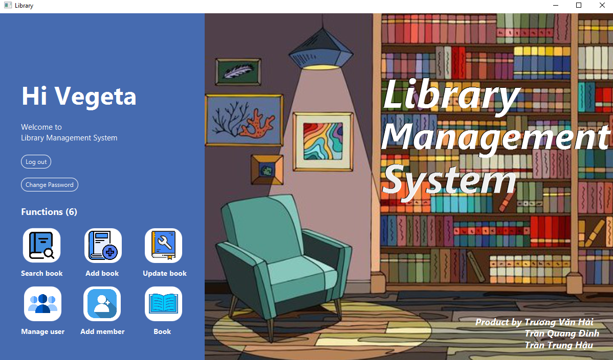
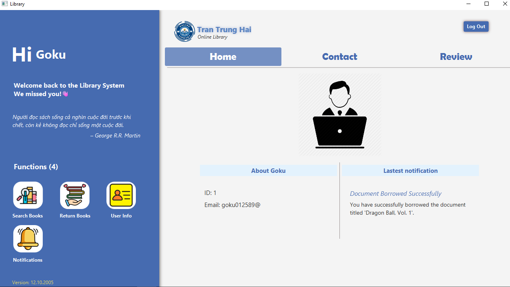
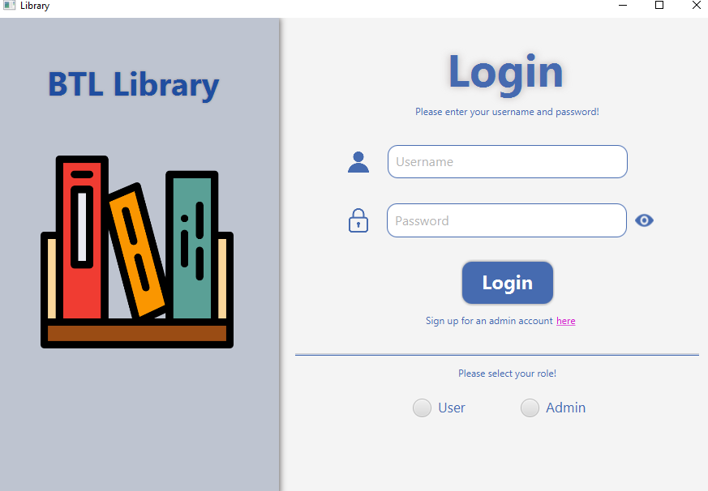
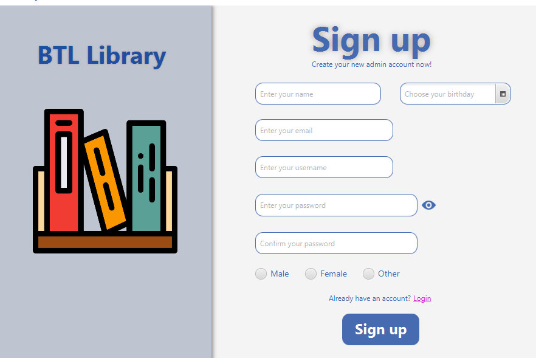
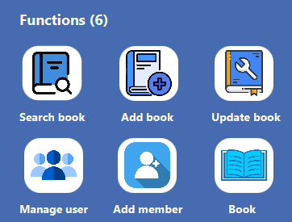
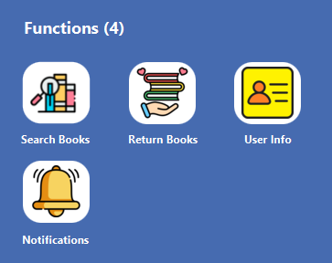
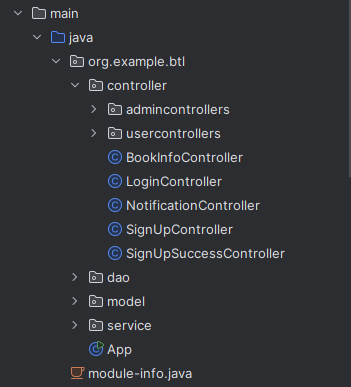
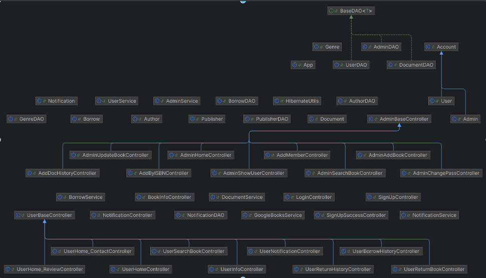
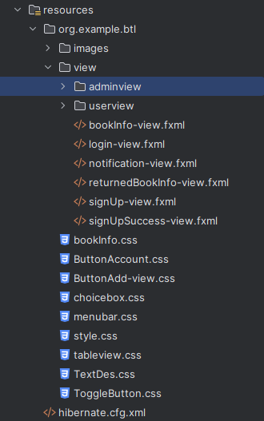
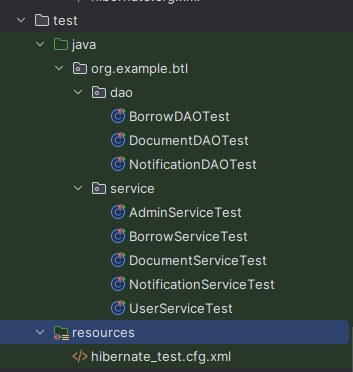

# Online library

----
## Mục lục

### 1. Giới thiệu

### 2. Tổng quan về ứng dụng

#### 2.1 [Giới thiệu chung](#intro)
#### 2.2 [Chức năng](#use)
#### 2.3 [Kiến thức áp dụng](#knowledge)
#### 2.4 [Giao diện](#graphics)
#### 2.5 [Cấu trúc](#structure)

---

## 1. Giới thiệu
Ứng dụng được phát triển bởi 3 thành viên: 
 | Họ và tên |  MSV  |
 |----------|--------|
 | Trương Văn Hải | 23020058 |
 | Trần Trung Hậu | 23020061 |
 | Trần Quang Đỉnh | 23020043 |
 - Lớp học phần: INT2204 7 - UET.
## 2. Tổng quan về ứng dụng
#### 2.1 Giới thiệu chung 
Ứng dụng Online Library, với giao diện thân thiện, trực quan và các tính năng mạnh mẽ, được thiết kế với hai vai trò chính: người quản lí (admin) và người dùng (user). 
Ứng dụng đơn giản hoá và tối ưu hoá việc quản lí các hoạt động trong thư viện dành cho người quản lí, đồng thời mang đến trải nghiệm tiện lợi cho người dùng.

- Admin
  
  
  
- User
  
  
#### 2.2 Chức năng 
- Đăng nhập/kí: gồm 2 vai trò
  
    

- Admin

  
  - Search book: cho phép admin tìm kiếm sách theo các tiêu chí, xoá hoặc cập nhật sách.
  - Add Book: cho phép admin thêm sách vào trong thư viện bằng 2 cách: "Normal" - thêm sách một cách bình thường và "ISBN" - thêm sách bằng mã ISBN.
  - Update Book: cho phép admin cập nhật sách (với những quyển được thêm bằng ISBN, chỉ có thể cập nhật số lượng sách).
  - Manage User: cho phép admin quản lí người dùng thư viện, có thể thêm, xoá hoặc gửi tin nhắn cho user.
  - Add member: cho phép admin thêm người dùng (user) sử dụng thư viện.
  - Book: hiển thị lịch sử thêm sách.

 - User

   
   - User home: cho phép user xem thông tin cơ bản của họ(home), hoặc xem thông tin liên hệ(contact) đội ngũ sản xuất và đánh giá(review) về ứng dụng.
   - Search Books: cho phép user xem, tìm kiếm và mượn sách theo các tiêu chí, đồng thời có thể xem lịch sử mượn sách.
   - Return Books: Cho phép user xem, tìm và trả sách theo các tiêu chí, đồng thời có thể xem lịch sử trả sách.
   - User Info: cho phép user cập nhật thông tin cá nhân.
   - Notifications: cho phép user xem thông báo, bao gồm các chức năng xem, xoá, đánh dấu đã đọc,...

#### 2.3 Kiến thức áp dụng 
- Ngôn ngữ lập trình: Java.
- Áp dụng các kiến thức học trên trường và tự học:
  - OOP.
  - Database (SQLite).
  - JavaFx, css.
  - Hibernate và ORM.
  - Git và Github.
  - Đa luồng cải thiện trải nghiệm người dùng.
  - Tích hợp API tra cứu thông tin tài liệu.
  - Sử dụng đúng nguyên tắc coding convention.
  - Ngoại lệ xử lí lỗi.
#### 2.4 Giao diện 
 - Thiết kế giao diện với Javafx, css.
 - Sử dụng tài liệu hình ảnh trên các trang web miễn phí: Freepik,..
#### 2.5 Cấu trúc 
- main
  - java
    
  
  

    -- controller: liên kết với các file FXML, chịu trách nhiệm xử lí sự kiện và logic giao diện.
  
    -- dao: quản lý và thao tác dữ liệu trong cơ sở dữ liệu.
  
    -- model: chịu trách nhiệm việc quản lí và logic xử lí liên quan đến dữ liệu.
  
    -- service: lớp trung gian chịu trách nhiệm xử lý logic nghiệp vụ và kết nối giữa Controller và DAO.

  - resources
  
  

- test
  
  

